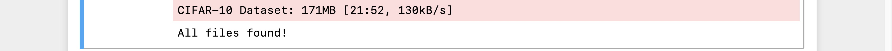
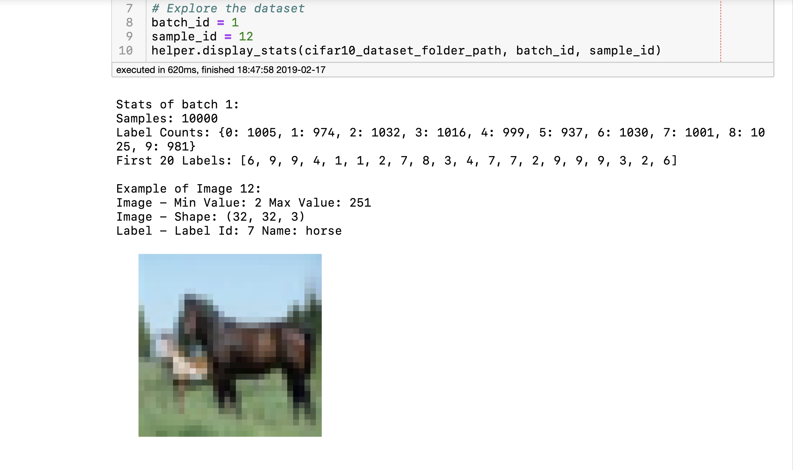
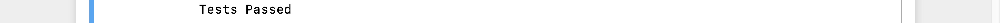

# Machine Learning Engineer Nanodegree

## Deep Learning

## Project: Image Classification

## Table of Contents

- [Introduction](#intro)
- [Get the Data](#get_data)
- [Exploring the Data](#explore)
- [Preprocessing Functions](#preprocess)
  - [Normalise](#norm)
  - [One-Hot Encode](#one-hot)
  - [Randomise Data](#rnd)
- [Preprocess All The Data And Save It](#save)
- [Checkpoint](#ckp)

***

<a id="intro"></a>

## Introduction

This is the second project in Term 2 of Udacity's Machine Learning Engineer
Nanodegree program.

In this project we'll classify images from the [CIFAR-10 data
set](https://www.cs.toronto.edu/~kriz/cifar.html). The data set consists of
airplanes, dogs, cats, and other objects. We'll preprocess the images, then train
a **convolutional neural network** on all the samples. The images need to be
**normalized** and the labels need to be **one-hot encoded.** We'll build a
convolutional, max-pooling, dropout, and fully connected layers. At the end,
we'll ge to see our neural network's predictions on the sample images.

<a id="get_data"></a>

## Get the Data

Run the following command in Python shell to download the [CIFAR-10 data set for
python](https://www.cs.toronto.edu/~kriz/cifar-10-python.tar.gz).

```python
from os.path import isfile, isdir
import problem_unittests as tests
import tarfile
from tqdm import tqdm
from urllib.request import urlretrieve

cifar10_dataset_folder_path = 'cifar-10-batches-py'

class DLProgress(tqdm):
    last_block = 0

    def hook(self, block_num=1, block_size=1, total_size=None):
        self.total = total_size
        self.update((block_num - self.last_block) * block_size)
        self.last_block = block_num

if not isfile('cifar-10-python.tar.gz'):
    with DLProgress(unit='B', unit_scale=True, miniters=1, desc='CIFAR-10 Dataset') as pbar:
        urlretrieve(
            'https://www.cs.toronto.edu/~kriz/cifar-10-python.tar.gz',
            'cifar-10-python.tar.gz',
            pbar.hook)

if not isdir(cifar10_dataset_folder_path):
    with tarfile.open('cifar-10-python.tar.gz') as tar:
        tar.extractall()
        tar.close()


tests.test_folder_path(cifar10_dataset_folder_path)
```

You should see output like this if the above command runs **without any error.**



<a id="explore"></a>

## Explore the Data

The dataset is broken into **batches** to prevent your machine from running out of memory.  The CIFAR-10 dataset consists of 5 batches, named `data_batch_1`, `data_batch_2`, etc.. Each batch contains the labels and images that are one of the following:

- airplane
- automobile
- bird
- cat
- deer
- dog
- frog
- horse
- ship
- truck

>Understanding a dataset is part of making predictions on the data.  Try changing
the values of the `batch_id` and `sample_id`. The
`batch_id` is the id for a batch (1-5). The `sample_id` is the id for a image
and label pair in the batch.

>Ask yourself "What are all possible labels?", "What is the range of values for
the image data?", "Are the labels in order or random?".  Answers to questions
like these will help you preprocess the data and end up with better predictions.

<a id="explore"></a>

A preview:



I tried different values of `sample_id` and came up with this alphabetical order for labels as shown
on [CIFAR-10 data set page](https://www.cs.toronto.edu/~kriz/cifar.html).

|label_id|label_name|
|--------|----------|
|0|airplane|
|1|automobile|
|2|bird|
|3|cat|
|4|deer|
|5|dog|
|6|frog|
|7|horse|
|8|ship|
|9|truck|

<a id="preprocess"></a>

## Preprocessing Functions

<a id="norm"></a>

### Normalise

```python
def normalize(x):
    """
    Normalize a list of sample image data in the range of 0 to 1
    : x: List of image data.  The image shape is (32, 32, 3)
    : return: Numpy array of normalize data
    """
    x_min = np.min(x)
    x_max = np.max(x)
    x_norm = []
    for image in x:
        x_norm.append((image - x_min) /\
                      (x_max - x_min))
    return np.array(x_norm)

# test
tests.test_normalize(normalize)
```

In the snippet above, the `normalize` function takes in image data, `x`, and returns it as a normalized Numpy array. The values are in the range of 0 to 1, inclusive.  The return object is the same shape as `x`.

If the above command runs without error, you should see this.



<a id="one-hot"></a>

### One-Hot Encode

Just like the previous method, you'll be implementing a function for
preprocessing.  This time, you'll implement the `one_hot_encode` function. The
input, `x`, are a list of labels.  The function `one_hot_encode()` returns the list
of labels as One-Hot encoded Numpy array.  The possible values for labels are 0
to 9.

```python
from sklearn.preprocessing import OneHotEncoder
def one_hot_encode(x, n = 10):
    """
    One hot encode a list of sample labels. Return a one-hot encoded vector for each label.
    : x: List of sample Labels
    : return: Numpy array of one-hot encoded labels
    """
    one_hot = OneHotEncoder(n_values = n)
    one_hot_encoded = one_hot.fit_transform(np.array(x).reshape(-1,1)) \
                             .toarray()
    return one_hot_encoded


# test
tests.test_one_hot_encode(one_hot_encode)
```

If the above command runs without error, you should see this.


<a id="rnd"></a>

### Randomise Data

As we saw from exploring the data [above](#above), the order of the samples are
randomised.  It doesn't hurt to randomize it again, but we don't need to for
this data set.

<a id="save"></a>

## Preprocess All The Data And Save It

```python
helper.preprocess_and_save_data(cifar10_dataset_folder_path, normalize, one_hot_encode)
```

This code will preprocess all the CIFAR-10 data and save it to file. The code
also uses 10% of the training data for validation.

<a id="ckp"></a>

## Checkpoint

This is the first checkpoint. If you ever decide to come back and restart the
notebook, you can start from here. The preprocessed data
has been saved to disk.

```python
import pickle
import problem_unittests as tests
import helper

# Load the Preprocessed Validation data
valid_features, valid_labels = pickle.load(open('preprocess_validation.p',\
                                                mode='rb'))
```

### Files

This project contains 3 files:

* `image_classification.ipynb`: This is the file where I did my main work, i.e., building the network, and training it for classification.

* Two helper files:
  * `helper.py`: It helps in performing some data loading and visualisation tasks.

  * `problem_unittests.py`: It contains some test functions that check whether I have performed the TO-DOs correctly.

### Libraries

This project is written in Python 3.x. CNN was made using TensorFlow framework
