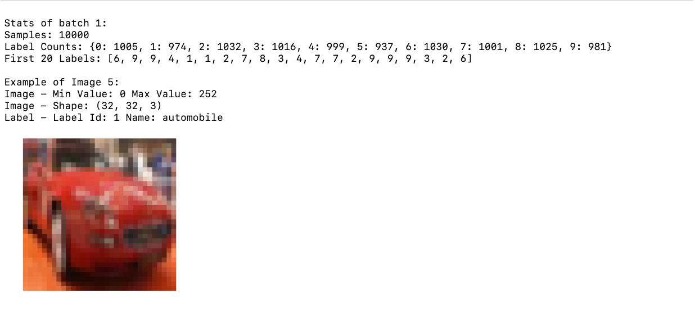
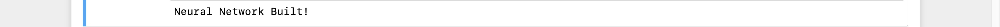
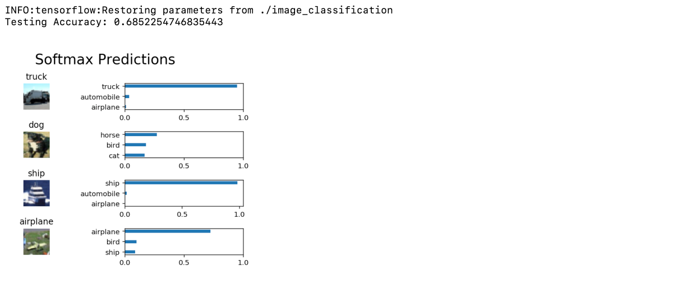

# Machine Learning Engineer Nanodegree

## Deep Learning

## Project: Image Classification

## Table of Contents

- [Introduction](#intro)
- [Get the Data](#get_data)
- [Explore the Data](#explore)
- [Preprocessing Functions](#preprocess)
  - [Normalise](#norm)
  - [One-Hot Encode](#one-hot)
  - [Randomise Data](#rnd)
- [Preprocess All The Data And Save It](#save)
- [Checkpoint](#ckp)
- [Build The Network](#build)
  - [Input](#inp)
  - [Convolution and Max Pooling Layer](#conv_maxp)
  - [Flatten Layer](#flatten)
  - [Fully-Connected Layer](#fcon)
  - [Output Layer](#out)
  - [Create Convolutional Model](#cnn_create)
- [Train The Neural Network](#train)
  - [Single Optimisation](#single_opt)
  - [Show Stats](#show_stats)
  - [Hyperparameters](#hyperp)
  - [Train on a Single CIFAR-10 Batch](#train_single)
  - [Fully Train The Model And Save](#train_full_ckp)
- [Test Model](#test)
- [Conclusion](#conclusion)
- [Files](#files)
- [Software Requirements](#sw)

***

<a id="intro"></a>

## Introduction

This is the second project in Term 2 of Udacity's Machine Learning Engineer
Nanodegree program.

In this project we'll classify images from the [CIFAR-10 data
set](https://www.cs.toronto.edu/~kriz/cifar.html). The data set consists of
airplanes, dogs, cats, and other objects. We'll preprocess the images, then train
a **convolutional neural network** on all the samples. The images need to be
**normalized** and the labels need to be **one-hot encoded.** We'll build a
convolutional, max-pooling, dropout, and fully connected layers. At the end,
we'll ge to see our neural network's predictions on the sample images.

<a id="get_data"></a>

## Get the Data

Run the following command in Python shell to download the [CIFAR-10 data set for
python](https://www.cs.toronto.edu/~kriz/cifar-10-python.tar.gz).

```python
from os.path import isfile, isdir
import problem_unittests as tests
import tarfile
from tqdm import tqdm
from urllib.request import urlretrieve

cifar10_dataset_folder_path = 'cifar-10-batches-py'

class DLProgress(tqdm):
    last_block = 0

    def hook(self, block_num=1, block_size=1, total_size=None):
        self.total = total_size
        self.update((block_num - self.last_block) * block_size)
        self.last_block = block_num

if not isfile('cifar-10-python.tar.gz'):
    with DLProgress(unit='B', unit_scale=True, miniters=1, desc='CIFAR-10 Dataset') as pbar:
        urlretrieve(
            'https://www.cs.toronto.edu/~kriz/cifar-10-python.tar.gz',
            'cifar-10-python.tar.gz',
            pbar.hook)

if not isdir(cifar10_dataset_folder_path):
    with tarfile.open('cifar-10-python.tar.gz') as tar:
        tar.extractall()
        tar.close()


tests.test_folder_path(cifar10_dataset_folder_path)
```

You should see output like this if the above command runs **without any error.**


<a id="explore"></a>

## Explore the Data

The dataset is broken into **batches** to prevent your machine from running out of memory.  The CIFAR-10 dataset consists of 5 batches, named `data_batch_1`, `data_batch_2`, etc.. Each batch contains the labels and images that are one of the following:

- airplane
- automobile
- bird
- cat
- deer
- dog
- frog
- horse
- ship
- truck

>Understanding a dataset is part of making predictions on the data.  Try changing
the values of the `batch_id` and `sample_id`. The
`batch_id` is the id for a batch (1-5). The `sample_id` is the id for a image
and label pair in the batch.

>Ask yourself "What are all possible labels?", "What is the range of values for
the image data?", "Are the labels in order or random?".  Answers to questions
like these will help you preprocess the data and end up with better predictions.

<a id="explore"></a>

A preview:



I tried different values of `sample_id` and came up with this alphabetical order for labels as shown
on [CIFAR-10 data set page](https://www.cs.toronto.edu/~kriz/cifar.html).

|label_id|label_name|
|--------|----------|
|0|airplane|
|1|automobile|
|2|bird|
|3|cat|
|4|deer|
|5|dog|
|6|frog|
|7|horse|
|8|ship|
|9|truck|

<a id="preprocess"></a>

## Preprocessing Functions

<a id="norm"></a>

### Normalise

```python
def normalize(x):
    """
    Normalize a list of sample image data in the range of 0 to 1
    : x: List of image data.  The image shape is (32, 32, 3)
    : return: Numpy array of normalize data
    """
    x_min = np.min(x)
    x_max = np.max(x)
    x_norm = []
    for image in x:
        x_norm.append((image - x_min) /\
                      (x_max - x_min))
    return np.array(x_norm)

# test
tests.test_normalize(normalize)
```

In the snippet above, the `normalize` function takes in image data, `x`, and returns it as a normalized Numpy array. The values are in the range of 0 to 1, inclusive.  The return object is the same shape as `x`.

If the above command runs without error, you should see this.


<a id="one-hot"></a>

### One-Hot Encode

Just like the previous method, you'll be implementing a function for
preprocessing.  This time, you'll implement the `one_hot_encode` function. The
input, `x`, are a list of labels.  The function `one_hot_encode()` returns the list
of labels as One-Hot encoded Numpy array.  The possible values for labels are 0
to 9.

```python
from sklearn.preprocessing import OneHotEncoder
def one_hot_encode(x, n = 10):
    """
    One hot encode a list of sample labels. Return a one-hot encoded vector for each label.
    : x: List of sample Labels
    : return: Numpy array of one-hot encoded labels
    """
    one_hot = OneHotEncoder(n_values = n)
    one_hot_encoded = one_hot.fit_transform(np.array(x).reshape(-1,1)) \
                             .toarray()
    return one_hot_encoded


# test
tests.test_one_hot_encode(one_hot_encode)
```

If the above command runs without error, you should see this.


<a id="rnd"></a>

### Randomise Data

As we saw from exploring the data [above](#above), the order of the samples are
randomised.  It doesn't hurt to randomize it again, but we don't need to for
this data set.

<a id="save"></a>

## Preprocess All The Data And Save It

```python
helper.preprocess_and_save_data(cifar10_dataset_folder_path, normalize, one_hot_encode)
```

This code will preprocess all the CIFAR-10 data and save it to file. The code
also uses 10% of the training data for validation.

<a id="ckp"></a>

## Checkpoint

This is the first checkpoint. If you ever decide to come back and restart the
notebook, you can start from here. The preprocessed data
has been saved to disk.

```python
import pickle
import problem_unittests as tests
import helper

# Load the Preprocessed Validation data
valid_features, valid_labels = pickle.load(open('preprocess_validation.p',\
                                                mode='rb'))
```

<a id="build"></a>

## Build The Network

For the neural network, we'll build each layer into a function. This is good for
testing purpose.

<a id="inp"></a>

### Input

The neural network needs to read the image data, one-hot encoded labels, and
dropout keep probability. The following functions performs the above mentioned
tasks:

- `neural_net_image_input(image_shape)`
  - Return a [TF
  Placeholder](https://www.tensorflow.org/api_docs/python/tf/placeholder)
  - Set the shape using `image_shape` with batch size set to `None`.
  - Name the TensorFlow placeholder "x" using the TensorFlow `name` parameter in the [TF Placeholder](https://www.tensorflow.org/api_docs/python/tf/placeholder).
- `neural_net_label_input(n_classes)`
  - Return a [TF Placeholder](https://www.tensorflow.org/api_docs/python/tf/placeholder)
  - Set the shape using `n_classes` with batch size set to `None`.
  - Name the TensorFlow placeholder "y" using the TensorFlow `name` parameter in the [TF Placeholder](https://www.tensorflow.org/api_docs/python/tf/placeholder)
- `neural_net_keep_prob_input()`
  - Return a [TF Placeholder](https://www.tensorflow.org/api_docs/python/tf/placeholder) for dropout keep probability.
  - Name the TensorFlow placeholder "keep_prob" using the TensorFlow `name` parameter in the [TF Placeholder](https://www.tensorflow.org/api_docs/python/tf/placeholder).

```python
import tensorflow as tf

def neural_net_image_input(image_shape):
    """
    Return a Tensor for a batch of image input
    : image_shape: Shape of the images
    : return: Tensor for image input.
    """
    return tf.placeholder(dtype = tf.float32,\
                          shape = [None, image_shape[0],\
                                   image_shape[1], image_shape[2]],\
                          name = 'x')


def neural_net_label_input(n_classes):
    """
    Return a Tensor for a batch of label input
    : n_classes: Number of classes
    : return: Tensor for label input.
    """
    return tf.placeholder(dtype = tf.float32,\
                          shape = [None, n_classes],\
                          name = 'y')


def neural_net_keep_prob_input():
    """
    Return a Tensor for keep probability
    : return: Tensor for keep probability.
    """
    return tf.placeholder(dtype = tf.float32,\
                          name = 'keep_prob')

tf.reset_default_graph()
tests.test_nn_image_inputs(neural_net_image_input)
tests.test_nn_label_inputs(neural_net_label_input)
tests.test_nn_keep_prob_inputs(neural_net_keep_prob_input)
```

You should see output like this if the above command runs **without any error.**


These names will be used when loading our model in the end.

>Note: `None` for shapes in TensorFlow allow for a dynamic size.

<a id="conv_maxp"></a>

### Convolution and Max Pooling Layer

Convolution layers have a lot of success with images. For this task, the
function `conv2d_maxpool` will perform the following:

- Create the weight and bias using `conv_ksize`, `conv_num_outputs` and the shape of `x_tensor`.
- Apply a convolution to `x_tensor` using weight and `conv_strides`.
  - I'll use same padding, but you're welcome to use any padding.
- Add bias
- Add a nonlinear activation to the convolution.
- Apply Max Pooling using `pool_ksize` and `pool_strides`.
  - I'll use same padding, but you're welcome to use any padding.

```python
def conv2d_maxpool(x_tensor, conv_num_outputs, conv_ksize, conv_strides, pool_ksize, pool_strides):
    """
    Apply convolution then max pooling to x_tensor
    :param x_tensor: TensorFlow Tensor
    :param conv_num_outputs: Number of outputs for the convolutional layer
    :param conv_ksize: kernal size 2-D Tuple for the convolutional layer
    :param conv_strides: Stride 2-D Tuple for convolution
    :param pool_ksize: kernal size 2-D Tuple for pool
    :param pool_strides: Stride 2-D Tuple for pool
    : return: A tensor that represents convolution and max pooling of x_tensor
    """
    w = tf.Variable(tf.random_normal(shape = [conv_ksize[0],
                                             conv_ksize[1],
                                             x_tensor.get_shape().as_list()[3],
                                             conv_num_outputs],
                                    stddev = 0.1))
    b = tf.Variable(tf.zeros(conv_num_outputs, dtype = tf.float32))
    x_tensor = tf.nn.conv2d(x_tensor,
                            w,
                            [1, conv_strides[0], conv_strides[1], 1],
                           padding = 'SAME')
    x_tensor = tf.nn.bias_add(x_tensor, b)

    x_tensor = tf.nn.relu(x_tensor)

    x_tensor = tf.nn.max_pool(x_tensor,
                            [1, pool_ksize[0], pool_ksize[1], 1],
                            [1, pool_strides[0], pool_strides[1], 1],
                            padding = 'SAME')
    return x_tensor


"""
DON'T MODIFY ANYTHING IN THIS CELL THAT IS BELOW THIS LINE
"""
tests.test_con_pool(conv2d_maxpool)
```

If the above command runs without error, you should see this.


<a id="flatten"></a>

### Flatten Layer

```python
def flatten(x_tensor):
    """
    Flatten x_tensor to (Batch Size, Flattened Image Size)
    : x_tensor: A tensor of size (Batch Size, ...), where ... are the image dimensions.
    : return: A tensor of size (Batch Size, Flattened Image Size).
    """
    layer = tf.contrib.layers.flatten(x_tensor)
    return layer

tests.test_flatten(flatten)
```

If the above command runs without error, you should see this.


The `flatten` function changes the dimension of `x_tensor` from a 4-D tensor to a 2-D tensor.  The output is the shape (*Batch Size*, *Flattened Image Size*).

<a id="fcon"></a>

### Fully-Connected Layer

```python
def fully_conn(x_tensor, num_outputs):
    """
    Apply a fully connected layer to x_tensor using weight and bias
    : x_tensor: A 2-D tensor where the first dimension is batch size.
    : num_outputs: The number of output that the new tensor should be.
    : return: A 2-D tensor where the second dimension is num_outputs.
    """
    layer = tf.contrib.layers.fully_connected(x_tensor, num_outputs)
    return layer

tests.test_fully_conn(fully_conn)
```

If the above command runs without error, you should see this.


The `fully_conn` function applies a fully connected layer to `x_tensor` with the shape (*Batch Size*, *num_outputs*).

<a id="out"></a>

### Output Layer

```python
def output(x_tensor, num_outputs):
    """
    Apply a output layer to x_tensor using weight and bias
    : x_tensor: A 2-D tensor where the first dimension is batch size.
    : num_outputs: The number of output that the new tensor should be.
    : return: A 2-D tensor where the second dimension is num_outputs.
    """
    layer = tf.contrib.layers.fully_connected(x_tensor, num_outputs, activation_fn = None)
    return layer

tests.test_output(output)
```

If the above command runs without error, you should see this.


The `output` function applies a fully connected layer to `x_tensor` with the shape (*Batch Size*, *num_outputs*).

>**Note:** Activation, softmax, or cross entropy should **not** be applied to this.

<a id="cnn_create"></a>

### Create Convolutional Model

The function `conv_net` creates a convolutional neural network model. The
function takes in a batch of images, `x`, and outputs logits.  We'll use the
layers we created above to create this model:

- Apply 1, 2, or 3 Convolution and Max Pool layers
- Apply a Flatten Layer
- Apply 1, 2, or 3 Fully Connected Layers
- Apply an Output Layer
- Return the output
- Apply [TensorFlow's Dropout](https://www.tensorflow.org/api_docs/python/tf/nn/dropout) to one or more layers in the model using `keep_prob`. 

```python
def conv_net(x, keep_prob):
    """
    Create a convolutional neural network model
    : x: Placeholder tensor that holds image data.
    : keep_prob: Placeholder tensor that hold dropout keep probability.
    : return: Tensor that represents logits
    """
    # Apply 1, 2, or 3 Convolution and Max Pool layers
    # Function Definition from Above:
    ## conv2d_maxpool(x_tensor, conv_num_outputs, conv_ksize, conv_strides, pool_ksize, pool_strides)
    x = conv2d_maxpool(x, 8, (4,4), (1,1), (3,3), (2,2))
    x = conv2d_maxpool(x, 16, (4,4), (1,1), (3,3), (2,2))
    x = conv2d_maxpool(x, 32, (4,4), (1,1), (3,3), (2,2))

    # Apply a Flatten Layer
    # Function Definition from Above:
    ## flatten(x_tensor)
    x = flatten(x)
    x = tf.nn.dropout(x, keep_prob)

    # Apply 1, 2, or 3 Fully Connected Layers
    # Function Definition from Above:
    ## fully_conn(x_tensor, num_outputs)
    x = fully_conn(x, 512)
    x = fully_conn(x, 360)
    x = tf.nn.dropout(x, keep_prob)

    # Apply an Output Layer
    # Set this to the number of classes
    # Function Definition from Above:
    ##   output(x_tensor, num_outputs)
    x = output(x, 10)

    # Return output
    return x
"""
DON'T MODIFY ANYTHING IN THIS CELL THAT IS BELOW THIS LINE
"""

##############################
## Build the Neural Network ##
##############################

# Remove previous weights, bias, inputs, etc..
tf.reset_default_graph()

# Inputs
x = neural_net_image_input((32, 32, 3))
y = neural_net_label_input(10)
keep_prob = neural_net_keep_prob_input()

# Model
logits = conv_net(x, keep_prob)

# Name logits Tensor, so that is can be loaded from disk after training
logits = tf.identity(logits, name='logits')

# Loss and Optimizer
cost = tf.reduce_mean(tf.nn.softmax_cross_entropy_with_logits(logits=logits, labels=y))
optimizer = tf.train.AdamOptimizer().minimize(cost)

# Accuracy
correct_pred = tf.equal(tf.argmax(logits, 1), tf.argmax(y, 1))
accuracy = tf.reduce_mean(tf.cast(correct_pred, tf.float32), name='accuracy')

tests.test_conv_net(conv_net)
```

If the above command runs without error, you should see this.



<a id="train"></a>

## Train The Neural Network

<a id="single_opt"></a>

### Single Optimisation

```python
def train_neural_network(session, optimizer, keep_probability, feature_batch, label_batch):
    """
    Optimize the session on a batch of images and labels
    : session: Current TensorFlow session
    : optimizer: TensorFlow optimizer function
    : keep_probability: keep probability
    : feature_batch: Batch of Numpy image data
    : label_batch: Batch of Numpy label data
    """
    session.run(optimizer,\
                feed_dict = {x:feature_batch, y:label_batch, keep_prob:keep_probability})
    pass

tests.test_train_nn(train_neural_network)
```

If the above command runs without error, you should see this.


The function `train_neural_network` does a single optimisation. The optimisation uses `optimizer` to optimise in `session` with a `feed_dict` of the following:

- `x` for image input
- `y` for labels
- `keep_prob` for keep probability for dropout

>Note: Nothing needs to be returned. This function is only optimizing the neural network.

<a id="show_stats"></a>

### Show Stats

```python
def print_stats(session, feature_batch, label_batch, cost, accuracy):
    """
    Print information about loss and validation accuracy
    : session: Current TensorFlow session
    : feature_batch: Batch of Numpy image data
    : label_batch: Batch of Numpy label data
    : cost: TensorFlow cost function
    : accuracy: TensorFlow accuracy function
    """
    loss = session.run(cost, feed_dict = {x:feature_batch,
                                         y:label_batch,
                                         keep_prob:1.0})

    acc = session.run(accuracy, feed_dict = {x:valid_features,
                                            y:valid_labels,
                                            keep_prob:1.0})

    print('Loss={0} ValidAcc={1}'.format(loss, acc))
```

The function `print_stats` prints loss and validation accuracy. It uses the
global variables `valid_features` and `valid_labels` to calculate validation
accuracy. We use a keep probability of `1.0` to calculate the loss and validation
accuracy.

<a id="hyperp"></a>

### Hyperparameters

I tried tuning the following parameters:

- Set `epochs` to the number of iterations until the network stops learning or start overfitting
- Set `batch_size` to the highest number that your machine has memory for.  Most people set them to common sizes of memory:
  - 64
  - 128
  - 256
  - ...
- Set `keep_probability` to the probability of keeping a node using dropout

The hyperparameters which I used are:

```python
epochs = 30
batch_size = 128
keep_probability = 0.5
```

<a id="train_single"></a>

### Train on a Single CIFAR-10 Batch

Instead of training the neural network on all the CIFAR-10 batches of data,
let's use a single batch. This will save time while we iterate on the model to
get a better accuracy.

```python
with tf.Session() as sess:
    # Initializing the variables
    sess.run(tf.global_variables_initializer())
    
    # Training cycle
    for epoch in range(epochs):
        batch_i = 1
        for batch_features, batch_labels in helper.load_preprocess_training_batch(batch_i, batch_size):
            train_neural_network(sess, optimizer, keep_probability, batch_features, batch_labels)
        print('Epoch {:>2}, CIFAR-10 Batch {}:  '.format(epoch + 1, batch_i), end='')
        print_stats(sess, batch_features, batch_labels, cost, accuracy)
```


<a id="train_full_ckp"></a>

### Fully Train The Model And Save

After we get a good accuracy with a single CIFAR-10 batch, try it with all five
batches.

```python
save_model_path = './image_classification'

print('Training...')
with tf.Session() as sess:
    # Initializing the variables
    sess.run(tf.global_variables_initializer())

    # Training cycle
    for epoch in range(epochs):
        # Loop over all batches
        n_batches = 5
        for batch_i in range(1, n_batches + 1):
            for batch_features, batch_labels in helper.load_preprocess_training_batch(batch_i, batch_size):
                train_neural_network(sess, optimizer, keep_probability, batch_features, batch_labels)
            print('Epoch {:>2}, CIFAR-10 Batch {}:  '.format(epoch + 1, batch_i), end='')
            print_stats(sess, batch_features, batch_labels, cost, accuracy)

    # Save Model
    saver = tf.train.Saver()
    save_path = saver.save(sess, save_model_path)
```

The model has been saved to disk after running the above command.

<a id="test"></a>

## Test Model



The above model provided an accuracy of 68%.

<a id="conclusion"></a>

## Conclusion

**Why 50-80% Accuracy?**

You might be wondering why we can't get an accuracy any higher. First things
first, 50% isn't bad for a simple CNN.  Pure guessing would get you 10%
accuracy. That's because there are many more techniques that can be applied to
your model.

<a id="files"></a>

## Files

This project contains 3 files:

- `image_classification.ipynb`: This is the file where I did my main work, i.e., building the network, and training it for classification.

- Two helper files:
  - `helper.py`: It helps in performing some data loading and visualisation tasks.

  - `problem_unittests.py`: It contains some test functions that check whether I have performed the TO-DOs correctly.

<a id="sw"></a>

## Software Requirements

This project is written in Python 3.5.x. CNN was made using TensorFlow
framework.
